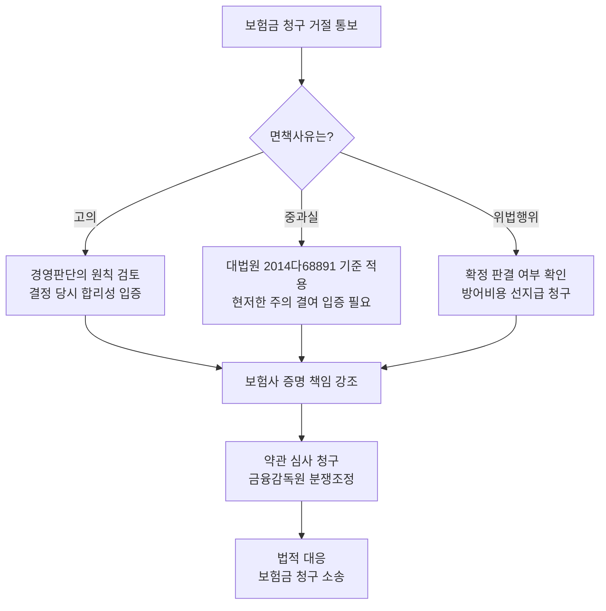

# D&O 보험 청구 3대 면책사유: 고의·중과실·위법행위의 경계

## ?? ?

이 소책자는 같은 이름의 대시보드 HTML과 별개로, 파일 하나만 읽어도 핵심 흐름을 이해할 수 있도록 정리한 독립 독서용 md이다. 현재 단계의 목적은 기존 공개 산출물의 내용을 보존하고, 이후 개별 이슈 고도화 작업에 들어가기 전 기준 상태를 고정하는 데 있다.

> https://woosungjo-law.github.io/share/d/dno-insurance-exclusion-j8i0.html

*출처: 조우성 변호사 / 로펌 머스트노우 | 문의: law@mustknow.co.kr*

## 3줄 요약 (TL;DR)

- **D&O 보험의 3대 면책사유(고의·중과실·위법행위)는 개념의 경계가 모호해 분쟁의 핵심이다.** 보험사는 이 면책사유를 근거로 보험금 지급을 거절하지만, 각 개념의 해석과 증명 책임이 쟁점이 된다.
- **중과실은 '고의에 가까운 현저한 주의 결여 상태'로 정의된다**(대법원 2014다68891). 단순한 부주의나 경과실과 달리, 약간의 주의만 기울였어도 손쉽게 방지할 수 있었음에도 만연히 간과한 경우에만 인정된다.
- **방어비용은 면책사유와 별개의 문제다.** 위법행위가 확정되기 전까지 방어비용은 지급되어야 한다는 견해가 유력하며, Side B(회사 보상담보)·Side C(증권담보) 구조 이해 없이는 실효적 보호가 어렵다.

---

## 1. D&O 보험 면책사유의 구조 — 3대 면책사유 개요

**한눈에**
- D&O 보험은 1990년대 미국 약관을 국내에 도입한 구조로, **한국 법체계(고의·과실·중과실 체계)와 미국식 면책 체계 사이에 충돌**이 있다.
- 3대 면책사유(고의·중과실·위법행위)는 약관상 포괄적으로 규정되어 있어 해석 여지가 넓고, 보험금 청구 거절의 핵심 사유로 작용한다.

### D&O 보험 3구조(Side ABC) 이해

> **실무 포인트**: Side B는 회사가 임원을 보호하기 위해 마련한 장치라는 점에서, **회사 차원의 사전 보상 정책(정관·내부규정)** 과 연계되어야 실효성이 있다. Side B 청구에서 면책사유가 적용되면 회사가 임원에게 보상한 금액을 돌려받지 못하게 되므로, 이중 리스크가 발생한다.

### 3대 면책사유 한눈에 비교

---

## 2. 고의(故意) — 가장 명백하지만 가장 좁은 면책사유

**한눈에**
- **고의는 보험사가 증명해야 하며, 증명 책임이 가장 엄격하다.**
- **미필적 고의도 고의에 포함**되지만, 행위자가 결과 발생을 인식·용인했는지가 핵심 쟁점이다.
- 이사가 사업상 결정을 내린 경우, 결과적으로 회사에 손해가 발생해도 **경영판단의 원칙**에 의해 보호받을 수 있다.

### 고의 vs 중과실 vs 경과실 비교

> [근거/조문] **상법 제659조(고의·중과실 면책)** — 보험사고가 보험계약자·피보험자의 고의 또는 중대한 과실로 인하여 생긴 때에는 보험자는 보험금을 지급할 책임이 없다. 다만 보험사고가 중대한 과실로 인하여 생긴 경우에 보험자가 인수한 위험의 성질과 정도, 보험료율, 보험계약의 체결 경위 등에 비추어 보험자가 그 중대한 과실로 인한 보험사고를 인수하는 것이 보험사업의 공공성에 반하지 아니하는 경우에는 보험자가 책임을 진다.
> 웹(law.go.kr) 현행 확인

> [근거/판례] **대법원 2022. 8. 31. 선고 2018다304014 판결** — 보험약관상 면책사유인 '고의'에는 미필적 고의도 포함되나, 행위자가 결과 발생을 인식하고 용인하였는지는 엄격하게 판단해야 한다.
> 웹 확인 (실존·현행)

### 경영판단의 원칙과의 관계

이사의 사업상 결정에 대해 사후적으로 손해가 발생했더라도, 다음 요건을 충족하면 **경영판단의 원칙**에 의해 고의가 부정될 수 있다.

- 결정 당시 합리적 정보에 기반했는가
- 회사의 이익을 위한 선의의 결정이었는가
- 이해충돌이 없었는가

---

## 3. 중과실(重過失) — 가장 분쟁이 많은 면책사유

**한눈에**
- **중과실은 D&O 보험 실무에서 가장 많이 다투어지는 면책사유**다. 보험사가 중과실을 주장하지만, 대법원은 엄격한 요건을 요구한다.
- **중과실 인정 기준**: "약간의 주의만 기울였어도 손쉽게 위법 결과를 예견하고 방지할 수 있었음에도 이를 만연히 간과한, 거의 고의에 가까운 현저한 주의 결여 상태"

### 중과실 판단 기준 — 대법원 2014다68891

> [근거/판례] **대법원 2017. 3. 30. 선고 2014다68891 판결** — "중대한 과실이라 함은 통상인에게 요구되는 주의의무를 다하지 않은 것을 넘어, 약간의 주의만 기울였어도 손쉽게 위법 결과를 예견하고 방지할 수 있었음에도 이를 만연히 간과한, 거의 고의에 가까운 현저한 주의 결여 상태를 말한다."
> 웹(law.go.kr) 현행 확인

### 중과실 해당 사례 vs 비해당 사례

### 보험사의 증명 책임

면책사유(중과실)의 증명 책임은 **보험사**에게 있다. 보험사는 단순히 결과의 중대성만으로 중과실을 주장할 수 없고, 이사의 구체적 행위가 위 기준에 해당함을 입증해야 한다. 중과실이 인정되지 않으면 면책은 부정되고 보험금이 지급된다.

---

## 4. 위법행위(違法行爲) — 가장 넓은 면책사유의 함정

**한눈에**
- **위법행위는 3대 면책사유 중 가장 포괄적이지만, 해석상 쟁점도 가장 많다.**
- 핵심 쟁점: **확정 판결이 필요한가, 아니면 혐의 단계에서도 면책이 가능한가?**
- **방어비용(변호사 선임 비용)은 위법행위 확정 전까지 지급되어야 한다**는 해석이 실무상 유력하다.

### 위법행위 면책의 시간적 흐름

> **실무 포인트**: 위법행위가 확정 판결로 인정되기 전까지는 보험사가 방어비용 지급을 거절하기 어렵다. 따라서 이사가 조사·수사 단계에서 적극적으로 방어할 수 있는 재원이 D&O 보험을 통해 확보된다. 이것이 D&O 보험의 핵심 실익이다.

### 위법행위 판단의 3단계

### 위법행위 영역별 주요 위험

---

## 5. 실무 대응 체크리스트 — 면책 리스크 최소화 전략

**한눈에**
- D&O 보험의 면책 리스크는 **사전 대비**가 가장 효과적이다. 보험 가입 전 약관 검토에서부터 이사회 운영·의사록 관리까지 종합적 접근이 필요하다.
- **방어비용 확보, Side B 구조 이해, 정관 정비**가 3대 핵심 전략이다.

### 사전 대비 체크리스트

- [ ] **약관 면책사유 검토** — 고의·중과실·위법행위의 정의와 범위가 구체적인가? 포괄적·추상적 문구는 협상으로 개정
- [ ] **방어비용 우선 지급 조항 확인** — 위법행위 확정 전까지 방어비용이 선지급되는 구조인가?
- [ ] **Side B(회사 보상담보) 한도 확인** — 회사가 임원을 보상할 수 있는 한도와 조건이 적절한가?
- [ ] **정관상 면책·보상 조항 정비** — 상법 제400조(주주 전원 동의) 대신 정관에 이사 면책 기준을 구체적으로 명시
- [ ] **이사회 의사록 관리** — 반대의견·이유를 의사록에 명확히 기재, 찬성추정 방지(상법 제399조제3항)
- [ ] **내부통제 시스템** — 이사회 결의 프로세스, 전문가 자문 의무화, 내부 보고 체계 구축
- [ ] **임원 교육** — D&O 보험 면책사유와 경영판단의 원칙에 대한 정기 교육 실시
- [ ] **사고 발생 시 대응 프로토콜** — 즉시 보험사 통지, 증거 보전, 변호사 선임, 언론 대응

### 보험사 면책 주장에 대한 대응 플로우

> **참고**: 상기 플로우는 mermaid 형식이며, md 렌더러에서 다이어그램으로 표시됩니다. HTML 버전에서는 텍스트 단계별 대응표로 대체됩니다.

### 단계별 대응 액션 플랜

---

## 자주 묻는 질문 (Q&A)

**Q1. D&O 보험에서 '고의'와 '중과실'의 실무적 차이는 무엇인가요?**

고의는 결과 발생을 알면서 행위한 경우(미필적 고의 포함)이고, 중과실은 '고의에 가까운 현저한 주의 결여' 상태입니다(대법원 2014다68891). 실무적 차이는 **증명 난이도**에 있습니다. 고의는 보험사가 이사의 내심(주관적 인식)까지 증명해야 하므로 가장 증명이 어렵고, 중과실은 객관적 주의의무 위반 정도를 기준으로 판단하므로 상대적으로 증명이 수월합니다. 보험사는 중과실을 먼저 주장하는 경우가 많고, 중과실이 인정되지 않으면 고의 주장은 더욱 어려워집니다.

**Q2. 법원에서 확정 판결이 나지 않았는데 보험사가 위법행위를 이유로 면책을 주장할 수 있나요?**

보험약관의 해석에 따라 다르나, 대부분의 표준약관은 **확정 판결이 있어야 면책이 확정된다**고 보는 것이 일반적입니다. 확정 판결 전까지는 **방어비용이 선지급되어야 한다**는 해석이 실무상 유력합니다. 보험사가 확정 판결 전에 방어비용 지급을 거절하면 금융감독원 분쟁조정 또는 보험금 청구 소송을 통해 대응할 수 있습니다.

**Q3. 이사회에서 반대 의견을 표시했는데도 면책이 되나요?**

**이사회에서 반대 의견을 표시하고 이를 의사록에 기재한 경우**, 해당 이사는 상법 제399조제3항에 의해 이사의 책임이 면제될 수 있습니다. 이는 D&O 보험 청구에서도 중요한 방어 근거가 됩니다. 단순히 반대만 표시하는 것을 넘어, **반대 이유와 대안을 의사록에 구체적으로 기재**하는 것이 면책 효과를 강화합니다. 의사록에 반대의견·이유가 명확히 기재되어 있으면, 보험사가 '고의'나 '중과실'을 주장하기도 어려워집니다.

**Q4. 상법 제400조(주주 전원 동의에 의한 이사 책임 면제)를 정관에 반영하면 D&O 보험의 면책 리스크가 줄어드나요?**

네, 상법 제400조는 이사의 회사에 대한 책임을 주주 전원의 동의로 면제할 수 있도록 규정합니다. 이를 정관에 반영하고, 실제 이사 책임이 문제된 경우 주주 전원 동의 절차를 거치면, 회사 차원의 책임 추궁 자체가 차단되어 D&O 보험 청구로 이어지지 않을 수 있습니다. 다만 **제3자(주주·채권자)에 대한 책임은 면제되지 않으므로**, Side A(임원 개인 보호)는 별도로 유지되어야 합니다. 실무적으로는 정관에 **이사 책임 감경 기준과 회사의 보상(Indemnification) 조항**을 함께 명시하는 것이 권장됩니다.

**Q5. 보험사가 중과실을 주장하면 반드시 보험금이 지급되지 않나요?**

아닙니다. 중과실의 증명 책임은 **보험사**에게 있습니다. 대법원 2014다68891 판결은 중과실을 엄격하게 정의하고 있으므로, 보험사는 단순히 '결과가 중대하다'거나 '주의가 부족했다'는 점만으로 중과실을 증명할 수 없습니다. 이사 측에서 결정 당시의 합리적 정보·절차·전문가 자문 내역 등을 입증하면 중과실이 부정될 가능성이 높습니다. 또한 상법 제659조 단서는 "보험사업의 공공성에 반하지 않는 경우" 중과실 사고도 인수 가능함을 명시하고 있어, 약관의 구체적 내용에 따라 보험사의 책임이 인정될 수 있습니다.

---

## ???

이 문서는 freeze 기준의 소책자형 md이다. 이후 정식 이슈 작업 단계에서는 doctrine을 1차 축으로 삼고, 허용된 웹 검색과 한국법 MCP 검증을 통해 근거와 최신성을 보강한다.